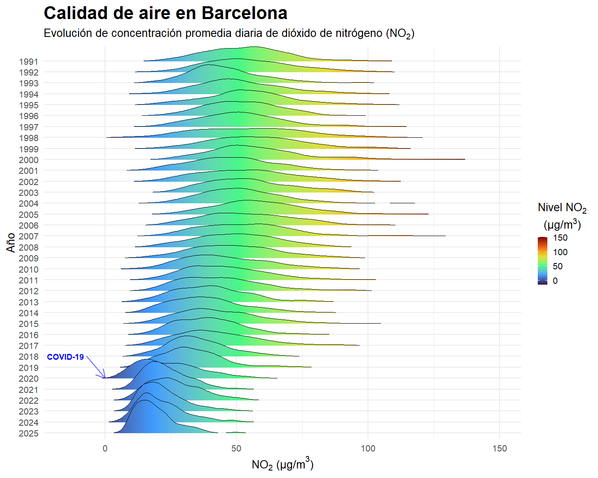

``` r
# install.packages("ggplot2")
library(ggplot2)
library(tidyverse)
```

```
## ── Attaching core tidyverse packages ──────────────────────── tidyverse 2.0.0 ──
## ✔ dplyr     1.1.4     ✔ readr     2.1.5
## ✔ forcats   1.0.1     ✔ stringr   1.5.2
## ✔ lubridate 1.9.4     ✔ tibble    3.3.0
## ✔ purrr     1.1.0     ✔ tidyr     1.3.1
## ── Conflicts ────────────────────────────────────────── tidyverse_conflicts() ──
## ✖ dplyr::filter() masks stats::filter()
## ✖ dplyr::lag()    masks stats::lag()
## ℹ Use the conflicted package (<http://conflicted.r-lib.org/>) to force all conflicts to become errors
```

``` r
# install.packages("ggridges")
library(ggridges)
```

Load data.


``` r
df <- read_csv('Qualitat_de_l’aire_Barcelona_NO2.csv', 
               # specify column types and exclude the ones that are not needed
               # https://readr.tidyverse.org/reference/read_delim.html
               col_types = '_cDncc______nnnnnnnnnnnnnnnnnnnnnnnn____',   
               locale=locale(date_format="%d/%m/%Y", decimal_mark='.', grouping_mark=",")
               )
df
```

```
## # A tibble: 68,006 × 29
##    `NOM ESTACIO` DATA       MAGNITUD CONTAMINANT UNITATS `01h` `02h` `03h` `04h`
##    <chr>         <date>        <dbl> <chr>       <chr>   <dbl> <dbl> <dbl> <dbl>
##  1 Barcelona (O… 2025-10-26        8 NO2         µg/m3       2     2     1     2
##  2 Barcelona (S… 2025-10-26        8 NO2         µg/m3       8     8     7     7
##  3 Barcelona (P… 2025-10-26        8 NO2         µg/m3       6     8     6     7
##  4 Barcelona (P… 2025-10-26        8 NO2         µg/m3      21    16    19    10
##  5 Barcelona (E… 2025-10-26        8 NO2         µg/m3      24    14    15    10
##  6 Barcelona (C… 2025-10-26        8 NO2         µg/m3      12     9    10    15
##  7 Barcelona (P… 2025-10-26        8 NO2         µg/m3      13    10    10    13
##  8 Barcelona (G… 2025-10-26        8 NO2         µg/m3      11    11     8     6
##  9 Barcelona (P… 2025-10-25        8 NO2         µg/m3      12     8    11     3
## 10 Barcelona (P… 2025-10-25        8 NO2         µg/m3      60    61    54    56
## # ℹ 67,996 more rows
## # ℹ 20 more variables: `05h` <dbl>, `06h` <dbl>, `07h` <dbl>, `08h` <dbl>,
## #   `09h` <dbl>, `10h` <dbl>, `11h` <dbl>, `12h` <dbl>, `13h` <dbl>,
## #   `14h` <dbl>, `15h` <dbl>, `16h` <dbl>, `17h` <dbl>, `18h` <dbl>,
## #   `19h` <dbl>, `20h` <dbl>, `21h` <dbl>, `22h` <dbl>, `23h` <dbl>,
## #   `24h` <dbl>
```

Calculate average for each day and station.


``` r
df$daily_avg <- rowMeans(df[6:29], na.rm=TRUE)
df_avg <- df[c('NOM ESTACIO', 'DATA', 'CONTAMINANT', 'UNITATS', 'daily_avg')]
df_avg
```

```
## # A tibble: 68,006 × 5
##    `NOM ESTACIO`                     DATA       CONTAMINANT UNITATS daily_avg
##    <chr>                             <date>     <chr>       <chr>       <dbl>
##  1 Barcelona (Observatori Fabra)     2025-10-26 NO2         µg/m3        1.75
##  2 Barcelona (Sants)                 2025-10-26 NO2         µg/m3        7.5 
##  3 Barcelona (Palau Reial)           2025-10-26 NO2         µg/m3        6.75
##  4 Barcelona (Parc Vall Hebron)      2025-10-26 NO2         µg/m3       16.5 
##  5 Barcelona (Eixample)              2025-10-26 NO2         µg/m3       15.8 
##  6 Barcelona (Ciutadella)            2025-10-26 NO2         µg/m3       11.5 
##  7 Barcelona (Poblenou)              2025-10-26 NO2         µg/m3       11.5 
##  8 Barcelona (Gràcia - Sant Gervasi) 2025-10-26 NO2         µg/m3        9   
##  9 Barcelona (Palau Reial)           2025-10-25 NO2         µg/m3       11.2 
## 10 Barcelona (Poblenou)              2025-10-25 NO2         µg/m3       33.3 
## # ℹ 67,996 more rows
```

Calculate average across all stations on the same day and extract observation year.


``` r
df_bcn_avg <- df_avg %>% 
  mutate(year = format(DATA, "%Y")) %>%
  group_by(CONTAMINANT, UNITATS, DATA, year) %>%
  summarise(bcn_avg = mean(daily_avg)) %>%
  select(CONTAMINANT, UNITATS, DATA, year, bcn_avg)
```

```
## `summarise()` has grouped output by 'CONTAMINANT', 'UNITATS', 'DATA'. You can
## override using the `.groups` argument.
```

``` r
df_bcn_avg
```

```
## # A tibble: 12,675 × 5
## # Groups:   CONTAMINANT, UNITATS, DATA [12,675]
##    CONTAMINANT UNITATS DATA       year  bcn_avg
##    <chr>       <chr>   <date>     <chr>   <dbl>
##  1 NO2         µg/m3   1991-01-01 1991     24.5
##  2 NO2         µg/m3   1991-01-02 1991     45.6
##  3 NO2         µg/m3   1991-01-03 1991     78.1
##  4 NO2         µg/m3   1991-01-04 1991     50  
##  5 NO2         µg/m3   1991-01-05 1991     31.9
##  6 NO2         µg/m3   1991-01-06 1991     35.6
##  7 NO2         µg/m3   1991-01-07 1991     27.5
##  8 NO2         µg/m3   1991-01-08 1991     69.1
##  9 NO2         µg/m3   1991-01-09 1991     54.3
## 10 NO2         µg/m3   1991-01-10 1991     47.5
## # ℹ 12,665 more rows
```

Only leave NO2.


``` r
df_bcn_avg_filtered <- df_bcn_avg %>%
  filter(CONTAMINANT %in% c('NO2'))
df_bcn_avg_filtered
```

```
## # A tibble: 12,675 × 5
## # Groups:   CONTAMINANT, UNITATS, DATA [12,675]
##    CONTAMINANT UNITATS DATA       year  bcn_avg
##    <chr>       <chr>   <date>     <chr>   <dbl>
##  1 NO2         µg/m3   1991-01-01 1991     24.5
##  2 NO2         µg/m3   1991-01-02 1991     45.6
##  3 NO2         µg/m3   1991-01-03 1991     78.1
##  4 NO2         µg/m3   1991-01-04 1991     50  
##  5 NO2         µg/m3   1991-01-05 1991     31.9
##  6 NO2         µg/m3   1991-01-06 1991     35.6
##  7 NO2         µg/m3   1991-01-07 1991     27.5
##  8 NO2         µg/m3   1991-01-08 1991     69.1
##  9 NO2         µg/m3   1991-01-09 1991     54.3
## 10 NO2         µg/m3   1991-01-10 1991     47.5
## # ℹ 12,665 more rows
```

Plot the result.


``` r
# https://www.r-bloggers.com/2020/07/ive-been-waiting-for-a-guide-to-come-and-take-me-by-the-hand-ridgeline-plots-with-ggridges/

# Reverse the factor levels of the Year column
# https://www.geeksforgeeks.org/r-language/creating-horizontal-bar-plots-in-the-reverse-direction-in-r/
df_bcn_avg_filtered$year <- as.factor(df_bcn_avg_filtered$year)
df_bcn_avg_filtered$year_rev <- factor(df_bcn_avg_filtered$year, levels = rev(levels(df_bcn_avg_filtered$year)))

df_bcn_avg_filtered %>%
  # https://cran.r-project.org/web/packages/ggridges/vignettes/introduction.html
  ggplot(aes(x = bcn_avg, y = year_rev, fill = after_stat(x), height = after_stat(density))) +
  xlim(-15, 150) +
  # https://r-charts.com/distribution/ggridges/#color
  geom_density_ridges_gradient(scale = 3, rel_min_height = 0.005, stat = "density") +
  scale_fill_viridis_c(name = expression(atop('Nivel NO'[2], '(µg/m'^3*')')), option = "turbo") +
  # increase font size everywhere
  # https://ggplot2.tidyverse.org/articles/faq-customising.html#how-can-i-change-the-default-font-size-in-ggplot2
  theme_minimal(base_size = 20) +
  # increase title size
  # https://www.geeksforgeeks.org/r-language/how-to-change-font-size-of-plot-title-when-the-title-is-a-variable-in-ggplot2-in-r/
  theme(plot.title = element_text(size = 32, face = "bold")) +
  labs(title = 'Calidad de aire en Barcelona',
       subtitle = expression('Evolución de concentración promedia diaria de dióxido de nitrógeno (NO'[2]*')'),
       x = expression('NO'[2]*' (µg/m'^3*')'),
       y = 'Año') +
  annotate("segment", x = -7, xend = 0, y = "2018", yend = "2020", colour = "blue", linewidth=1, alpha=0.6, arrow=arrow()) +
  annotate("text", x = -15, y = "2018", 
           label = "COVID-19" , color="blue", 
           size=5 , angle=0, fontface="bold")
```

<!-- -->


``` r
ggsave("ridgeline.png")
```

```
## Saving 15 x 12 in image
```

Source: [Generalitat de Catalunya, portal de dades obertes](https://analisi.transparenciacatalunya.cat/Medi-Ambient/Qualitat-de-l-aire-als-punts-de-mesurament-autom-t/tasf-thgu/about_data).
