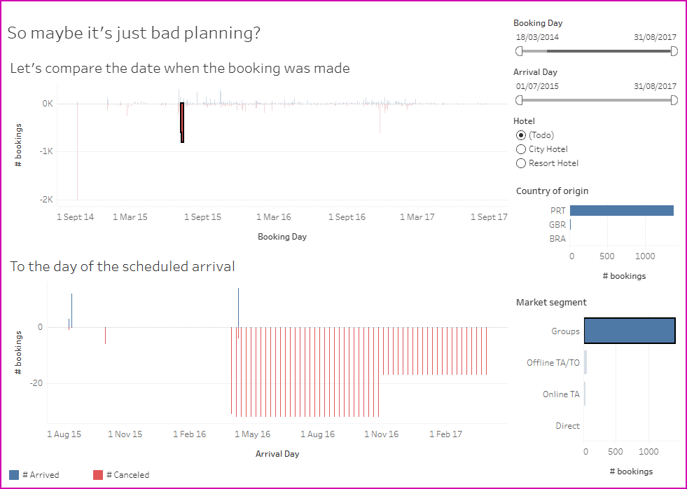

---
title: PEC3 - Data Storytelling
layout: default
filename: pec_3_data_storytelling
--- 
<html>
  
<noscript></noscript><object class='tableauViz'  style='display:none;'><param name='host_url' value='https%3A%2F%2Fpublic.tableau.com%2F' /> <param name='embed_code_version' value='3' /> <param name='site_root' value='' /><param name='name' value='Viz-PEC3-Hotelbookingsstory&#47;Aretouristsafraidofbadweather' /><param name='tabs' value='no' /><param name='toolbar' value='yes' /><param name='static_image' value='https:&#47;&#47;public.tableau.com&#47;static&#47;images&#47;Vi&#47;Viz-PEC3-Hotelbookingsstory&#47;Aretouristsafraidofbadweather&#47;1.png' /> <param name='animate_transition' value='yes' /><param name='display_static_image' value='yes' /><param name='display_spinner' value='yes' /><param name='display_overlay' value='yes' /><param name='display_count' value='yes' /><param name='language' value='es-ES' /><param name='filter' value='publish=yes' /></object>
                
  
  <small>Source 1: <a target="_blank" href="https://aula.uoc.edu/courses/61419/files/8395157/download?download_frd=1">Hotel bookings dataset provided by UOC</a>, accessed 08/12/2025</small>
   <small>Source 2: <a target="_blank" href="https://www.ncei.noaa.gov/cdo-web/datasets/GHCND/locations/FIPS:PO/detail">Portugal daily weather summaries from NOAA web</a>, accessed 19/12/2025</small>
   <small>Preprocessed with RStudio and visualized with Tableau by Elena Bydanova Puchkova (see <a target="_blank" href="https://public.tableau.com/views/Viz-PEC3-Hotelbookingsstory/Aretouristsafraidofbadweather?:language=es-ES&publish=yes&:sid=&:redirect=auth&:display_count=n&:origin=viz_share_link">publication in Tableau Public</a>)</small>
   <small><a target="_blank" href="https://github.com/ebydanova/ebydanova.github.io/blob/main/viz/pec3/data/hotel_bookings_preprocessed.zip">Download transformed data</a></small>

 
<h2>The Story</h2>
<h4>Many people book hotels well in advance. Weather forecasts typically cover a maximum of two weeks. So, what happens if the weather is worse than expected on the day of arrival?</h4>

Let's look at the cancellation rate based on booking lead time and the weather on arrival day. Those who book at most one week in advance tend to stick to their plan, canceling only about 10% of their reservations, with no apparent correlation to the temperature or rainfall. This suggests they were already aware of the potential impact. However, those who book up to one month in advance are also unaffected by the weather. It's only after one month that we start to see more cancellations on colder or rainier days. Okay, we already knew this – tourists are afraid of bad weather. But what about bookings made a year or more in advance? The pattern becomes more complicated, and, interestingly, many bookings are canceled when it's <strong>not</strong> raining and the temperature is quite pleasant, between 18 and 24°C. <strong>Now, how do we explain that?</strong>

<h4>Perhaps the problem is that 18°C ​​in January is not the same as 18°C ​​in August. Let's take a journey through time and see if our pattern of tourists being scared off by (relative) cold is consistent over months.</h4>

We start in July 2015 and see that for bookings up to six months in advance, there are more cancellations when it's below 23°C, which we can understand. But… here are 75 bookings made a year ago for days when it was 19°C and raining (remember, this is July!), and most of them have arrived, while the bookings for warmer days have almost all been canceled.

It's now March 2016, and as before, for bookings made up to six months in advance, we've noticed that rain is detrimental to the hotel business: 75% of bookings are canceled on rainy days, compared to only 35% on dry days. But again, older bookings break this pattern.

But the surprises don't end here. Let's skip to October 2016, only to find that the cancellation rate based on temperature and rainfall becomes random; in fact, there's a higher percentage of cancellations on days when it was 23°C than when it was 21°C. Clearly, something else besides the weather is responsible for lost customers.

We've seen that massive cancellations occur on certain days when bookings are made at least one month in advance. If we look at the pattern of when these bookings were made, we see that... on 17th of October 2014, more than 2000 group bookings were made for the second half of 2015, and virtually all of them were subsequently canceled. The pattern repeated itself on 25th of November 2016, with group bookings for the first half of 2017 (all canceled). But the most curious case of "spamming" occurred on 8th and 10th of July 2015, when bookings were made (again, for groups) for <strong>every Thursday</strong> since 31st of March 2016 till 30th of March 2017 (all canceled).

<h4>It seems that it's not bad weather that's driving away customers, but rather group bookings made "just in case" without even having real people behind them.</h4>

At this point, a curious reader can return to the beginning of our story, select market segments other than "Groups," and again visualize the behavior of travelers and its monthly changes (this time, supposedly, real travelers, not empty bookings). They can even focus on tourists from their country or a specific type of hotel they prefer. They will see that, although the overall picture shows more cancellations on relatively colder and rainier days, this relationship becomes more or less random when analyzed month by month.

<h4>Tourists aren't exactly made of cotton candy and bad weather is unlikely to make them change their plans... unless one of the other 1001 possible reasons has already done so.</h4>
</html>
