# Process original dataset with pre-registrations


``` r
# install.packages("ggplot2")
#library(ggplot2)
library(tidyverse)
```

```
## Warning: package 'ggplot2' was built under R version 4.5.2
```

```
## Warning: package 'purrr' was built under R version 4.5.2
```

```
## Warning: package 'stringr' was built under R version 4.5.2
```

```
## ── Attaching core tidyverse packages ──────────────────────── tidyverse 2.0.0 ──
## ✔ dplyr     1.1.4     ✔ readr     2.1.5
## ✔ forcats   1.0.1     ✔ stringr   1.6.0
## ✔ ggplot2   4.0.1     ✔ tibble    3.3.0
## ✔ lubridate 1.9.4     ✔ tidyr     1.3.1
## ✔ purrr     1.2.0     
## ── Conflicts ────────────────────────────────────────── tidyverse_conflicts() ──
## ✖ dplyr::filter() masks stats::filter()
## ✖ dplyr::lag()    masks stats::lag()
## ℹ Use the conflicted package (<http://conflicted.r-lib.org/>) to force all conflicts to become errors
```

Load data.


``` r
# unzip and read dataset file
df <- read_csv(unz('preinscipcions_20251119.zip', 'preinscipcions_20251119.csv'), 
               # specify column types and exclude the ones that are not needed
               # https://readr.tidyverse.org/reference/read_delim.html
               col_types = 'fcccfcccccccccccddddfficiiiii_',   
               locale=locale(date_format="%d/%m/%Y", decimal_mark=',', grouping_mark=".")
               )
df
```

```
## # A tibble: 221,732 × 29
##    Curs  `Codi centre` `Denominació completa` `Codi naturalesa` `Nom naturalesa`
##    <fct> <chr>         <chr>                  <chr>             <fct>           
##  1 2025… 08000013      Escola Francesc Plató… 1                 Públic          
##  2 2025… 08000013      Escola Francesc Plató… 1                 Públic          
##  3 2025… 08000013      Escola Francesc Plató… 1                 Públic          
##  4 2025… 08000013      Escola Francesc Plató… 1                 Públic          
##  5 2025… 08000013      Escola Francesc Plató… 1                 Públic          
##  6 2025… 08000013      Escola Francesc Plató… 1                 Públic          
##  7 2025… 08000013      Escola Francesc Plató… 1                 Públic          
##  8 2025… 08000013      Escola Francesc Plató… 1                 Públic          
##  9 2025… 08000013      Escola Francesc Plató… 1                 Públic          
## 10 2025… 08000049      Escola Fabra           1                 Públic          
## # ℹ 221,722 more rows
## # ℹ 24 more variables: `Codi titularitat` <chr>, `Nom titularitat` <chr>,
## #   `Codi Àrea Territorial` <chr>, `Nom Àrea Territorial` <chr>,
## #   `Codi comarca` <chr>, `Nom comarca` <chr>, `Codi municipi_5` <chr>,
## #   `Codi municipi_6` <chr>, `Nom municipi` <chr>,
## #   `Codi districte municipal` <chr>, `Nom DM` <chr>,
## #   `Coordenades UTM X` <dbl>, `Coordenades UTM Y` <dbl>, Longitud <dbl>, …
```

Dataset overview:


``` r
str(df)
```

```
## spc_tbl_ [221,732 × 29] (S3: spec_tbl_df/tbl_df/tbl/data.frame)
##  $ Curs                               : Factor w/ 9 levels "2025-2026","2024-2025",..: 1 1 1 1 1 1 1 1 1 1 ...
##  $ Codi centre                        : chr [1:221732] "08000013" "08000013" "08000013" "08000013" ...
##  $ Denominació completa               : chr [1:221732] "Escola Francesc Platón i Sartí" "Escola Francesc Platón i Sartí" "Escola Francesc Platón i Sartí" "Escola Francesc Platón i Sartí" ...
##  $ Codi naturalesa                    : chr [1:221732] "1" "1" "1" "1" ...
##  $ Nom naturalesa                     : Factor w/ 2 levels "Públic","Privat": 1 1 1 1 1 1 1 1 1 1 ...
##  $ Codi titularitat                   : chr [1:221732] "01" "01" "01" "01" ...
##  $ Nom titularitat                    : chr [1:221732] "Departament d'Educació i Formació Professional" "Departament d'Educació i Formació Professional" "Departament d'Educació i Formació Professional" "Departament d'Educació i Formació Professional" ...
##  $ Codi Àrea Territorial              : chr [1:221732] "0308" "0308" "0308" "0308" ...
##  $ Nom Àrea Territorial               : chr [1:221732] "Baix Llobregat" "Baix Llobregat" "Baix Llobregat" "Baix Llobregat" ...
##  $ Codi comarca                       : chr [1:221732] "11" "11" "11" "11" ...
##  $ Nom comarca                        : chr [1:221732] "Baix Llobregat" "Baix Llobregat" "Baix Llobregat" "Baix Llobregat" ...
##  $ Codi municipi_5                    : chr [1:221732] "08001" "08001" "08001" "08001" ...
##  $ Codi municipi_6                    : chr [1:221732] "080018" "080018" "080018" "080018" ...
##  $ Nom municipi                       : chr [1:221732] "Abrera" "Abrera" "Abrera" "Abrera" ...
##  $ Codi districte municipal           : chr [1:221732] "00" "00" "00" "00" ...
##  $ Nom DM                             : chr [1:221732] NA NA NA NA ...
##  $ Coordenades UTM X                  : num [1:221732] 408292 408292 408292 408292 408292 ...
##  $ Coordenades UTM Y                  : num [1:221732] 4596522 4596522 4596522 4596522 4596522 ...
##  $ Longitud                           : num [1:221732] 1.9 1.9 1.9 1.9 1.9 ...
##  $ Latitud                            : num [1:221732] 41.5 41.5 41.5 41.5 41.5 ...
##  $ Nom ensenyament                    : Factor w/ 3 levels "Educació primària",..: 1 2 1 2 1 1 1 2 1 1 ...
##  $ Nivell                             : Factor w/ 6 levels "5","3","1","2",..: 1 2 3 4 4 5 2 3 6 3 ...
##  $ Nombre grups                       : int [1:221732] 2 2 1 2 2 3 2 2 2 2 ...
##  $ Mixt                               : chr [1:221732] NA NA NA NA ...
##  $ Nombre places                      : int [1:221732] 50 40 20 40 50 75 50 40 50 40 ...
##  $ Places ofertades a la preinscripció: int [1:221732] 6 7 3 0 17 12 23 40 10 0 ...
##  $ Assignacions                       : int [1:221732] 0 1 1 0 1 1 2 37 1 0 ...
##  $ Assignacions: 1a peticio           : int [1:221732] 0 1 1 0 0 0 2 37 1 0 ...
##  $ Assignacions: Altres peticions     : int [1:221732] 0 0 0 0 1 1 0 0 0 0 ...
##  - attr(*, "spec")=
##   .. cols(
##   ..   Curs = col_factor(levels = NULL, ordered = FALSE, include_na = FALSE),
##   ..   `Codi centre` = col_character(),
##   ..   `Denominació completa` = col_character(),
##   ..   `Codi naturalesa` = col_character(),
##   ..   `Nom naturalesa` = col_factor(levels = NULL, ordered = FALSE, include_na = FALSE),
##   ..   `Codi titularitat` = col_character(),
##   ..   `Nom titularitat` = col_character(),
##   ..   `Codi Àrea Territorial` = col_character(),
##   ..   `Nom Àrea Territorial` = col_character(),
##   ..   `Codi comarca` = col_character(),
##   ..   `Nom comarca` = col_character(),
##   ..   `Codi municipi_5` = col_character(),
##   ..   `Codi municipi_6` = col_character(),
##   ..   `Nom municipi` = col_character(),
##   ..   `Codi districte municipal` = col_character(),
##   ..   `Nom DM` = col_character(),
##   ..   `Coordenades UTM X` = col_double(),
##   ..   `Coordenades UTM Y` = col_double(),
##   ..   Longitud = col_double(),
##   ..   Latitud = col_double(),
##   ..   `Nom ensenyament` = col_factor(levels = NULL, ordered = FALSE, include_na = FALSE),
##   ..   Nivell = col_factor(levels = NULL, ordered = FALSE, include_na = FALSE),
##   ..   `Nombre grups` = col_integer(),
##   ..   Mixt = col_character(),
##   ..   `Nombre places` = col_integer(),
##   ..   `Places ofertades a la preinscripció` = col_integer(),
##   ..   Assignacions = col_integer(),
##   ..   `Assignacions: 1a peticio` = col_integer(),
##   ..   `Assignacions: Altres peticions` = col_integer(),
##   ..   Georeferència = col_skip()
##   .. )
##  - attr(*, "problems")=<externalptr>
```

## Variables distribution

Let's check the values range and distribution of each variable that we plan to use.


``` r
unique(df$Curs)
```

```
## [1] 2025-2026 2024-2025 2023/2024 2022/2023 2021/2022 2020/2021 2019/2020
## [8] 2018/2019 2017/2018
## 9 Levels: 2025-2026 2024-2025 2023/2024 2022/2023 2021/2022 ... 2017/2018
```

``` r
plot(df$Curs)
```

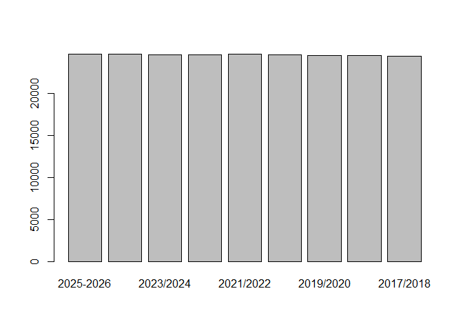<!-- -->


I notice that last 2 years have different format from the previous ones, using dash instead of slash, for example "2024-2025" instead of "2024/2025". We'll align the format of school years replacing dashes with forward slashes and re-coding the corresponding factor levels.


``` r
df <- df %>%
  mutate(
    Curs = recode(
      Curs,
      `2024-2025` = "2024/2025",
      `2025-2026` = "2025/2026"
    )
  )

unique(df$Curs)
```

```
## [1] 2025/2026 2024/2025 2023/2024 2022/2023 2021/2022 2020/2021 2019/2020
## [8] 2018/2019 2017/2018
## 9 Levels: 2025/2026 2024/2025 2023/2024 2022/2023 2021/2022 ... 2017/2018
```


Let's continue with checking other variables, now the coordinates:


``` r
hist(df$Longitud)
```

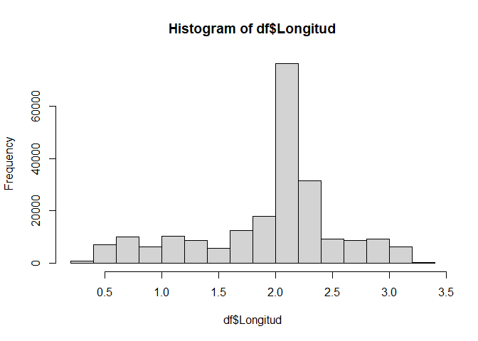<!-- -->


``` r
hist(df$Latitud)
```

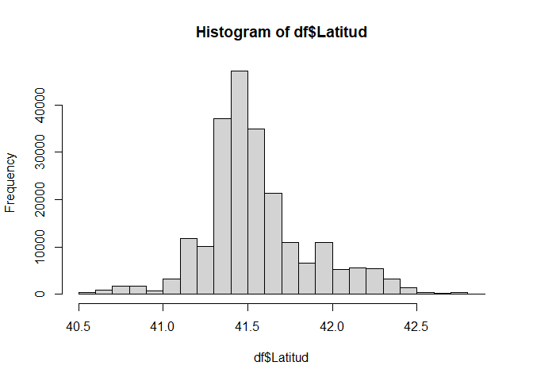<!-- -->

Latitud and Longitud seem rather reasonable, with no values too far from majority of observations. Due to Catalonia's geographic form, some locations are farther from the center than the rest, but not too far.

As for education levels, there should only be 3 types and max 6 levels.


``` r
plot(df$`Nom ensenyament`)
```

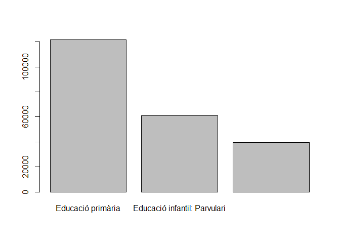<!-- -->

``` r
plot(df$Nivell)
```

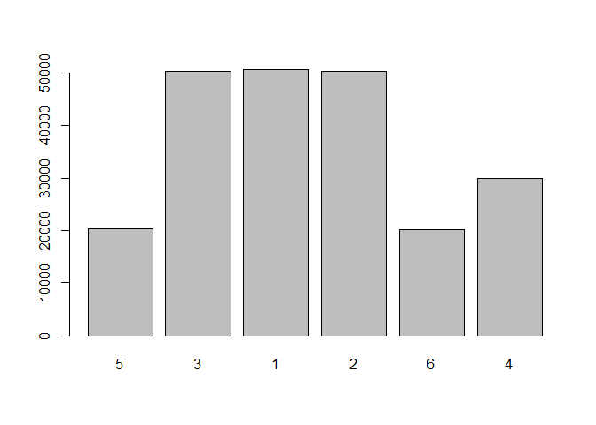<!-- -->

The education level values look ok.


``` r
table(df$Mixt)
```

```
## 
##     A     B     C     D     E     F     G     H     X 
## 10075  7972  3908  1046    36    11     6     3  2810
```

These are different types of mixed groups in rural schools (with several levels belonging to the same group), we won't be covering this information in our study.


Let's check number of groups in each school.


``` r
barplot(table(df$`Nombre grups`))
```

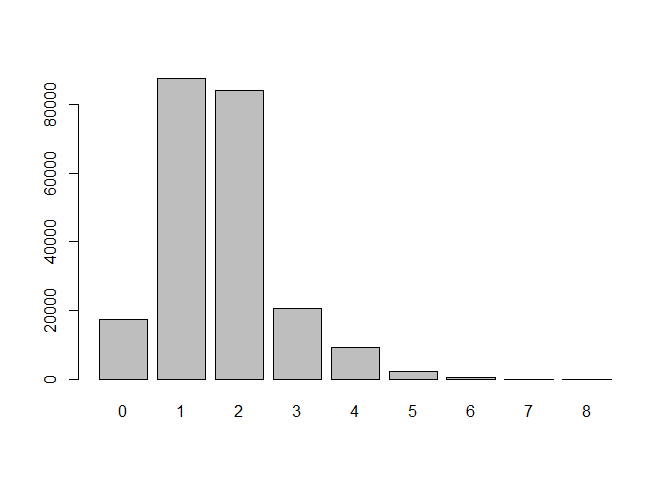<!-- -->

``` r
df[which(df$`Nombre grups` > 7),]
```

```
## # A tibble: 4 × 29
##   Curs   `Codi centre` `Denominació completa` `Codi naturalesa` `Nom naturalesa`
##   <fct>  <chr>         <chr>                  <chr>             <fct>           
## 1 2021/… 43003641      Institut Antoni de Ma… 1                 Públic          
## 2 2020/… 43003641      Institut Antoni de Ma… 1                 Públic          
## 3 2019/… 08076391      Institut Pedralbes     1                 Públic          
## 4 2019/… 43003641      Institut Antoni de Ma… 1                 Públic          
## # ℹ 24 more variables: `Codi titularitat` <chr>, `Nom titularitat` <chr>,
## #   `Codi Àrea Territorial` <chr>, `Nom Àrea Territorial` <chr>,
## #   `Codi comarca` <chr>, `Nom comarca` <chr>, `Codi municipi_5` <chr>,
## #   `Codi municipi_6` <chr>, `Nom municipi` <chr>,
## #   `Codi districte municipal` <chr>, `Nom DM` <chr>,
## #   `Coordenades UTM X` <dbl>, `Coordenades UTM Y` <dbl>, Longitud <dbl>,
## #   Latitud <dbl>, `Nom ensenyament` <fct>, Nivell <fct>, …
```

Most schools have 1 or 2 groups per level. However, there are 2 large schools in Tarragona and Barcelona that have up to 8 parallel groups in each education level. This seems to be a valid possibility.

Considering that we have some schools with up to 8 groups, there can be up to ~240 places offered in each education level. Let's review offered and assigned places.


``` r
hist(df$`Nombre places`)
```

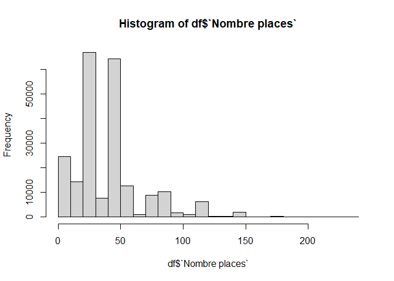<!-- -->

``` r
plot(sort(df$`Nombre places`))
grid()
```

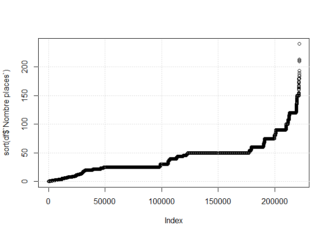<!-- -->

``` r
df[which(df$`Nombre places` > 240),]
```

```
## # A tibble: 0 × 29
## # ℹ 29 variables: Curs <fct>, Codi centre <chr>, Denominació completa <chr>,
## #   Codi naturalesa <chr>, Nom naturalesa <fct>, Codi titularitat <chr>,
## #   Nom titularitat <chr>, Codi Àrea Territorial <chr>,
## #   Nom Àrea Territorial <chr>, Codi comarca <chr>, Nom comarca <chr>,
## #   Codi municipi_5 <chr>, Codi municipi_6 <chr>, Nom municipi <chr>,
## #   Codi districte municipal <chr>, Nom DM <chr>, Coordenades UTM X <dbl>,
## #   Coordenades UTM Y <dbl>, Longitud <dbl>, Latitud <dbl>, …
```

It seems that the number of places offered corresponds to the number of groups, and no school offers more than 240 places, so we consider this correct.


``` r
hist(df$`Places ofertades a la preinscripció`)
```

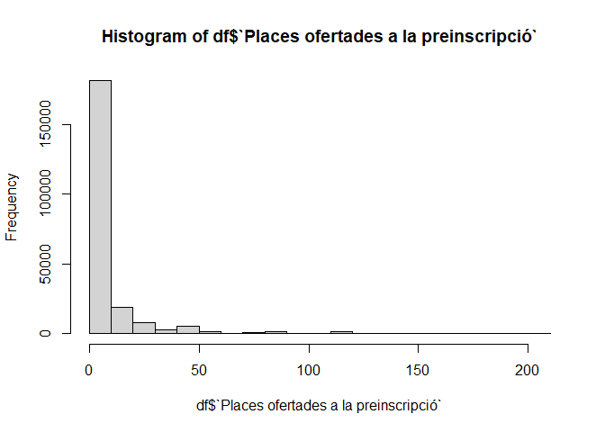<!-- -->

``` r
plot(sort(df$`Places ofertades a la preinscripció`))
grid()
```

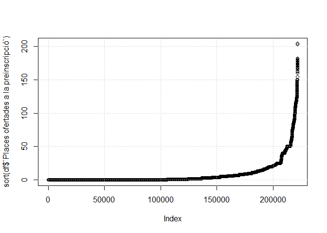<!-- -->

``` r
df[which.max(df$`Places ofertades a la preinscripció`),]
```

```
## # A tibble: 1 × 29
##   Curs   `Codi centre` `Denominació completa` `Codi naturalesa` `Nom naturalesa`
##   <fct>  <chr>         <chr>                  <chr>             <fct>           
## 1 2020/… 43003641      Institut Antoni de Ma… 1                 Públic          
## # ℹ 24 more variables: `Codi titularitat` <chr>, `Nom titularitat` <chr>,
## #   `Codi Àrea Territorial` <chr>, `Nom Àrea Territorial` <chr>,
## #   `Codi comarca` <chr>, `Nom comarca` <chr>, `Codi municipi_5` <chr>,
## #   `Codi municipi_6` <chr>, `Nom municipi` <chr>,
## #   `Codi districte municipal` <chr>, `Nom DM` <chr>,
## #   `Coordenades UTM X` <dbl>, `Coordenades UTM Y` <dbl>, Longitud <dbl>,
## #   Latitud <dbl>, `Nom ensenyament` <fct>, Nivell <fct>, …
```

Offered places are mainly 0 (due to continuity between levels) and none is greater than 240. This looks ok.


``` r
hist(df$Assignacions)
```

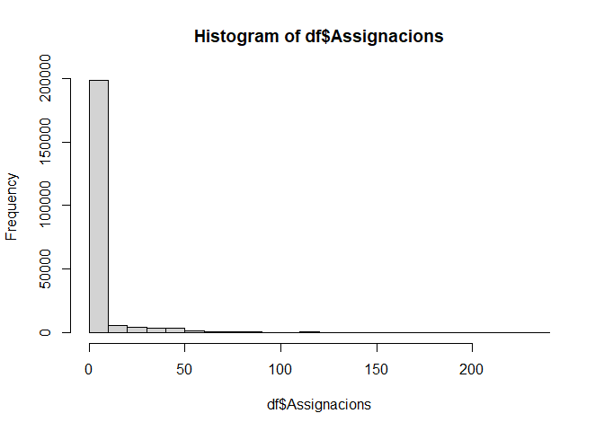<!-- -->

``` r
plot(sort(df$Assignacions))
grid()
```

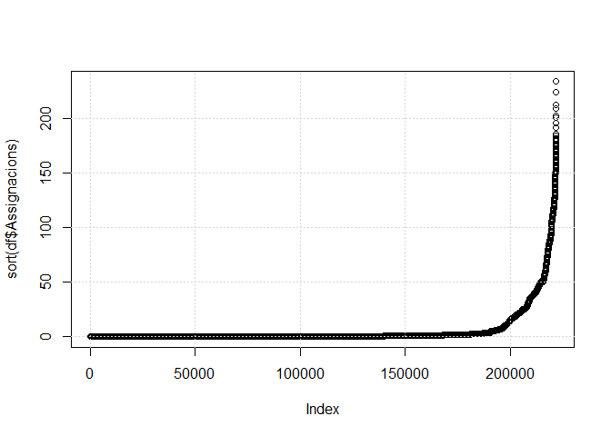<!-- -->

``` r
# look for assignments exceeding initial offer for more than 30
df[which(df$Assignacions > df$`Places ofertades a la preinscripció` + 30),]
```

```
## # A tibble: 37 × 29
##    Curs  `Codi centre` `Denominació completa` `Codi naturalesa` `Nom naturalesa`
##    <fct> <chr>         <chr>                  <chr>             <fct>           
##  1 2021… 08016793      Institut Francesc Mac… 1                 Públic          
##  2 2021… 08017931      Institut Antoni Cumel… 1                 Públic          
##  3 2021… 08026397      Institut Olorda        1                 Públic          
##  4 2021… 08044922      Institut Dr. Puigvert  1                 Públic          
##  5 2021… 08047492      Institut Ribera Baixa  1                 Públic          
##  6 2021… 08047832      Institut Joan Coromin… 1                 Públic          
##  7 2021… 08054228      Institut Joan Fuster   1                 Públic          
##  8 2021… 08054401      Institut El Sui        1                 Públic          
##  9 2021… 08064911      Institut Valèria Hali… 1                 Públic          
## 10 2021… 08065354      Institut Baix a mar    1                 Públic          
## # ℹ 27 more rows
## # ℹ 24 more variables: `Codi titularitat` <chr>, `Nom titularitat` <chr>,
## #   `Codi Àrea Territorial` <chr>, `Nom Àrea Territorial` <chr>,
## #   `Codi comarca` <chr>, `Nom comarca` <chr>, `Codi municipi_5` <chr>,
## #   `Codi municipi_6` <chr>, `Nom municipi` <chr>,
## #   `Codi districte municipal` <chr>, `Nom DM` <chr>,
## #   `Coordenades UTM X` <dbl>, `Coordenades UTM Y` <dbl>, Longitud <dbl>, …
```

The assignments in some secondary education schools for school years 2020/2021 and 2021/2022 exceed the initial offer by more than 1 full group. This could be due to Covid years and some errors in data collection, but can also be special cases when additional groups were being opened to accommodate all the pupils beyond the initial offer). Since secondary education is compulsory and a place within the same municipality is guaranteed to all children, this can be the case. None of the assignments exceed the 240 threshold (for max 8 groups), so we'll leave these records.


``` r
hist(df$`Assignacions: 1a peticio`)
```

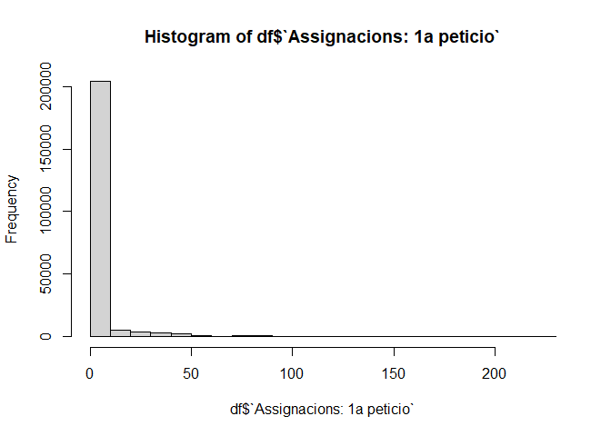<!-- -->

``` r
plot(sort(df$`Assignacions: 1a peticio`))
grid()
```

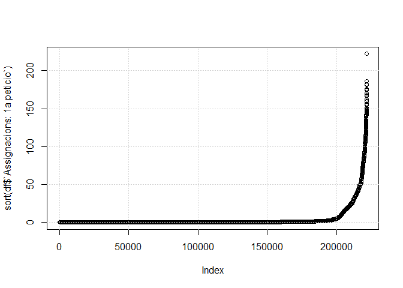<!-- -->

``` r
# look for assignments in 1st option greater than total assignments
df[which(df$`Assignacions: 1a peticio` > df$Assignacions),]
```

```
## # A tibble: 0 × 29
## # ℹ 29 variables: Curs <fct>, Codi centre <chr>, Denominació completa <chr>,
## #   Codi naturalesa <chr>, Nom naturalesa <fct>, Codi titularitat <chr>,
## #   Nom titularitat <chr>, Codi Àrea Territorial <chr>,
## #   Nom Àrea Territorial <chr>, Codi comarca <chr>, Nom comarca <chr>,
## #   Codi municipi_5 <chr>, Codi municipi_6 <chr>, Nom municipi <chr>,
## #   Codi districte municipal <chr>, Nom DM <chr>, Coordenades UTM X <dbl>,
## #   Coordenades UTM Y <dbl>, Longitud <dbl>, Latitud <dbl>, …
```


There are no assignments in 1st option greater than total assignments, so we'll consider this ok.


``` r
hist(df$`Assignacions: Altres peticions`)
```

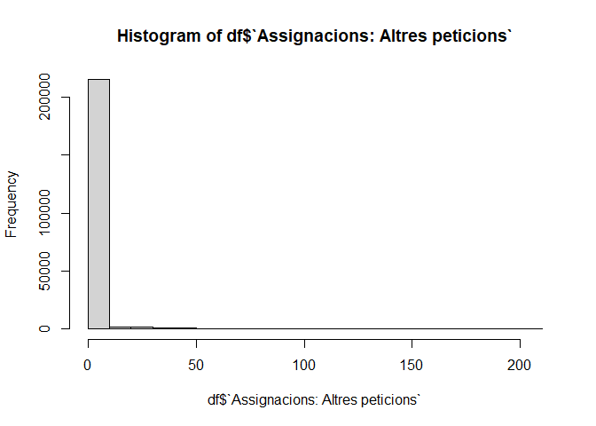<!-- -->

``` r
plot(sort(df$`Assignacions: Altres peticions`))
grid()
```

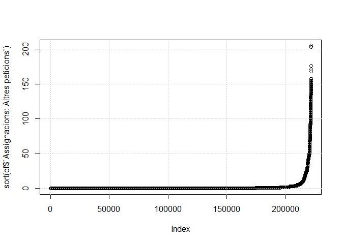<!-- -->

``` r
# look for assignments in other options greater than total assignments
df[which(df$`Assignacions: Altres peticions` > df$Assignacions),]
```

```
## # A tibble: 0 × 29
## # ℹ 29 variables: Curs <fct>, Codi centre <chr>, Denominació completa <chr>,
## #   Codi naturalesa <chr>, Nom naturalesa <fct>, Codi titularitat <chr>,
## #   Nom titularitat <chr>, Codi Àrea Territorial <chr>,
## #   Nom Àrea Territorial <chr>, Codi comarca <chr>, Nom comarca <chr>,
## #   Codi municipi_5 <chr>, Codi municipi_6 <chr>, Nom municipi <chr>,
## #   Codi districte municipal <chr>, Nom DM <chr>, Coordenades UTM X <dbl>,
## #   Coordenades UTM Y <dbl>, Longitud <dbl>, Latitud <dbl>, …
```

There are no assignments in other options greater than total assignments, so we'll consider this ok.


## Missing values

Check how many missing values there are in each variable


``` r
sort(colSums(is.na(df)), decreasing = T)
```

```
##                                Mixt                              Nom DM 
##                              195865                              172953 
##                   Coordenades UTM X                   Coordenades UTM Y 
##                                   1                                   1 
##                            Longitud                             Latitud 
##                                   1                                   1 
##                                Curs                         Codi centre 
##                                   0                                   0 
##                Denominació completa                     Codi naturalesa 
##                                   0                                   0 
##                      Nom naturalesa                    Codi titularitat 
##                                   0                                   0 
##                     Nom titularitat               Codi Àrea Territorial 
##                                   0                                   0 
##                Nom Àrea Territorial                        Codi comarca 
##                                   0                                   0 
##                         Nom comarca                     Codi municipi_5 
##                                   0                                   0 
##                     Codi municipi_6                        Nom municipi 
##                                   0                                   0 
##            Codi districte municipal                     Nom ensenyament 
##                                   0                                   0 
##                              Nivell                        Nombre grups 
##                                   0                                   0 
##                       Nombre places Places ofertades a la preinscripció 
##                                   0                                   0 
##                        Assignacions            Assignacions: 1a peticio 
##                                   0                                   0 
##      Assignacions: Altres peticions 
##                                   0
```


Check if there are missing values in the main measures (we'll ignore mixed groups indicator and district data which is only relevant for largest cities):


``` r
# list records with missing values
df %>% 
  select(-`Codi districte municipal`, -`Nom DM`, -Mixt) %>%
  filter(if_any(everything(), is.na))
```

```
## # A tibble: 1 × 26
##   Curs   `Codi centre` `Denominació completa` `Codi naturalesa` `Nom naturalesa`
##   <fct>  <chr>         <chr>                  <chr>             <fct>           
## 1 2022/… 08077371      Institut Escola El Mo… 1                 Públic          
## # ℹ 21 more variables: `Codi titularitat` <chr>, `Nom titularitat` <chr>,
## #   `Codi Àrea Territorial` <chr>, `Nom Àrea Territorial` <chr>,
## #   `Codi comarca` <chr>, `Nom comarca` <chr>, `Codi municipi_5` <chr>,
## #   `Codi municipi_6` <chr>, `Nom municipi` <chr>, `Coordenades UTM X` <dbl>,
## #   `Coordenades UTM Y` <dbl>, Longitud <dbl>, Latitud <dbl>,
## #   `Nom ensenyament` <fct>, Nivell <fct>, `Nombre grups` <int>,
## #   `Nombre places` <int>, `Places ofertades a la preinscripció` <int>, …
```

This record has a problem with coordinates. Regarding Longitude and Latitude of each school center, during final visualization I have detected inconsistencies in school year 2020/2021 compared to all other years - schools appear to have their coordinates shifted and assigned to other schools. In order to align school location across the years, I'll take latest coordinates registered for each education center and apply them to all previous years. This way the school positions won't be wobbling on the map as we track the changes year by year. As for UTM coordinates, we'll ignore them.


``` r
# remove UTM coordinates from dataset we'll not be using them
df <- df %>% 
  select(-`Coordenades UTM X`, -`Coordenades UTM Y`)

# assign to each education center the lat-lon coordinates it has in the latest preinscriptions
df <- df %>%
  group_by(`Codi centre`) %>%
  mutate(
    # extract year from "Curs" and look for latest (max) year
    Latitud = Latitud[which.max(as.integer(substr(as.character(Curs), 1, 4)))],
    Longitud = Longitud[which.max(as.integer(substr(as.character(Curs), 1, 4)))]
  ) %>%
  ungroup()
```


## Other checks and enhancements

During initial visualization I detected that numbers of pupils assigned in 1st petition and other petitions are anomalous for school years 2020/21 and 2021/22, apparently the columns "Assignacions: 1a peticio" and "Assignacions: Altres peticions" were swapped due to an error.


``` r
show_distr <- function(){
  df %>% 
    filter(`Nom ensenyament` == "Educació infantil: Parvulari" | `Nom ensenyament` == "Educació secundària obligatòria") %>%
    filter(Nivell == 1) %>%
    filter(`Places ofertades a la preinscripció` != 0 & `Assignacions` != 0) %>%
    ggplot() + 
    geom_histogram(aes(x=`Assignacions: 1a peticio`, fill="Assignacions: 1a peticio"), alpha=0.4, bins=100) + 
    geom_histogram(aes(x=`Assignacions: Altres peticions`, fill="Assignacions: Altres peticions"), alpha=0.4, bins=100) + 
    scale_fill_manual(name = "", values = c("Assignacions: 1a peticio" = "blue", "Assignacions: Altres peticions" = "red")) +
    facet_wrap( ~ Curs, ncol=1) +
    xlim(c(-1,50))
}
show_distr()
```

```
## Warning: Removed 4102 rows containing non-finite outside the scale range
## (`stat_bin()`).
```

```
## Warning: Removed 1307 rows containing non-finite outside the scale range
## (`stat_bin()`).
```

```
## Warning: Removed 18 rows containing missing values or values outside the scale range
## (`geom_bar()`).
## Removed 18 rows containing missing values or values outside the scale range
## (`geom_bar()`).
```

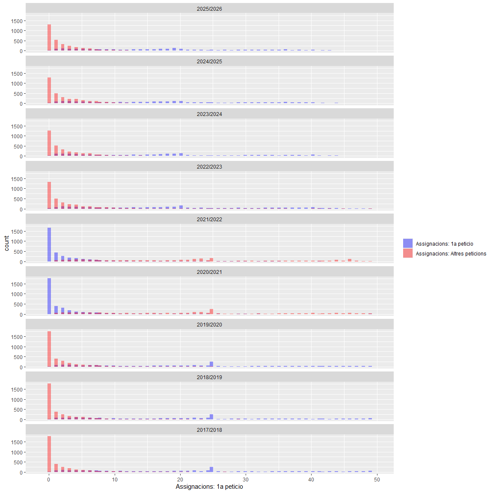<!-- -->

We'll swap values in columns "Assignacions: 1a peticio" and "Assignacions: Altres peticions" related to school years 2020-21 and 2021-22. There is no way to confirm if all the records for these years have swapped values or only some of them, but we'll apply transformation to all the records, which should already improve the data quality significantly.


``` r
# swap values in columns based on a condition in another column
# reference: https://stackoverflow.com/a/7746784

df[df$Curs %in% c("2020/2021", "2021/2022"), c("Assignacions: 1a peticio", "Assignacions: Altres peticions")] <- 
  df[df$Curs %in% c("2020/2021", "2021/2022"), c("Assignacions: Altres peticions", "Assignacions: 1a peticio")]

show_distr()
```

```
## Warning: Removed 5364 rows containing non-finite outside the scale range
## (`stat_bin()`).
```

```
## Warning: Removed 45 rows containing non-finite outside the scale range
## (`stat_bin()`).
```

```
## Warning: Removed 18 rows containing missing values or values outside the scale range
## (`geom_bar()`).
## Removed 18 rows containing missing values or values outside the scale range
## (`geom_bar()`).
```

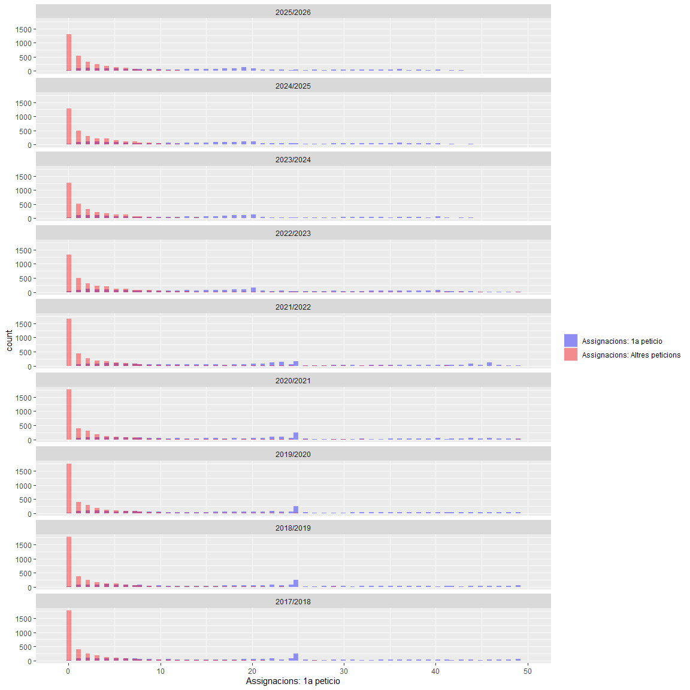<!-- -->


Upon further investigation, I found some inconsistencies in region name (comarcas). Region name for "Aran" was changed in 2023, and a new region "Lluçanès" appeared since school year 2024/2025 (created in 2023 [according to Wikipedia](https://ca.wikipedia.org/wiki/Llu%C3%A7an%C3%A8s)), so we'll have to unify the names for them.


``` r
# use new name for references to Aran
df$`Nom comarca`[df$`Nom comarca` == "Val d'Aran"] <- "Aran"

# reassign municipalities now considered as the new region of Lluçanès to their previous region - Osona, to obtain comparable data for all years
df$`Nom comarca`[df$`Nom comarca` == "Lluçanès"] <- "Osona"
```


I will add some of the proposed calculated variables (those that calculated at record level) directly to the dataset. The rest of the metrics proposed in the "PR1" document will be added as aggregations directly in Tableau.


``` r
df["Places vacants"] = df["Places ofertades a la preinscripció"] - df["Assignacions"]
# replace any resulting negative values by 0
df["Places vacants"][df["Places vacants"] < 0] <- 0

df["Places ocupades"] = df["Nombre places"] - df["Places ofertades a la preinscripció"] + df["Assignacions"]
df
```

```
## # A tibble: 221,732 × 29
##    Curs  `Codi centre` `Denominació completa` `Codi naturalesa` `Nom naturalesa`
##    <fct> <chr>         <chr>                  <chr>             <fct>           
##  1 2025… 08000013      Escola Francesc Plató… 1                 Públic          
##  2 2025… 08000013      Escola Francesc Plató… 1                 Públic          
##  3 2025… 08000013      Escola Francesc Plató… 1                 Públic          
##  4 2025… 08000013      Escola Francesc Plató… 1                 Públic          
##  5 2025… 08000013      Escola Francesc Plató… 1                 Públic          
##  6 2025… 08000013      Escola Francesc Plató… 1                 Públic          
##  7 2025… 08000013      Escola Francesc Plató… 1                 Públic          
##  8 2025… 08000013      Escola Francesc Plató… 1                 Públic          
##  9 2025… 08000013      Escola Francesc Plató… 1                 Públic          
## 10 2025… 08000049      Escola Fabra           1                 Públic          
## # ℹ 221,722 more rows
## # ℹ 24 more variables: `Codi titularitat` <chr>, `Nom titularitat` <chr>,
## #   `Codi Àrea Territorial` <chr>, `Nom Àrea Territorial` <chr>,
## #   `Codi comarca` <chr>, `Nom comarca` <chr>, `Codi municipi_5` <chr>,
## #   `Codi municipi_6` <chr>, `Nom municipi` <chr>,
## #   `Codi districte municipal` <chr>, `Nom DM` <chr>, Longitud <dbl>,
## #   Latitud <dbl>, `Nom ensenyament` <fct>, Nivell <fct>, …
```


# Process and add census data.


``` r
#Append all the files together
census_df = rbind(read.csv2("censph10com-1.csv", na.strings=c("null", "NULL", "")), 
                  read.csv2("censph10com-2.csv", na.strings=c("null", "NULL", "")))
# only leave columns of interest
census_df <- census_df[c("any", "comarca.o.Aran", "edat", "sexe", "valor")]
head(census_df)
```

```
##    any comarca.o.Aran   edat  sexe valor
## 1 2011       Alt Camp 0 anys homes   266
## 2 2011       Alt Camp 0 anys dones   272
## 3 2011       Alt Camp 0 anys total   538
## 4 2011       Alt Camp  1 any homes   277
## 5 2011       Alt Camp  1 any dones   252
## 6 2011       Alt Camp  1 any total   529
```


``` r
# reassign Lluçanès observations to Osona
census_df$`comarca.o.Aran`[census_df$`comarca.o.Aran` == "Lluçanès"] <- "Osona"
# group to sum up multiple resulting records
census_df <- census_df %>%
  group_by(across(-valor)) %>%
  summarise(
    valor = sum(as.integer(valor), na.rm = TRUE),
    .groups = "drop"
  )

head(census_df)
```

```
## # A tibble: 6 × 5
##     any comarca.o.Aran edat   sexe  valor
##   <int> <chr>          <chr>  <chr> <int>
## 1  1981 Alt Camp       0 anys dones   220
## 2  1981 Alt Camp       0 anys homes   264
## 3  1981 Alt Camp       0 anys total   484
## 4  1981 Alt Camp       1 any  dones   237
## 5  1981 Alt Camp       1 any  homes   233
## 6  1981 Alt Camp       1 any  total   470
```


Map census year to school year and age to education level. Additionally, filter out unused rows.


``` r
# pivot population by gender and total to columns
# reference: https://tidyr.tidyverse.org/reference/pivot_wider.html
census_df <- census_df %>%
  pivot_wider(names_from = sexe, values_from = valor)

census_df %>% head()
```

```
## # A tibble: 6 × 6
##     any comarca.o.Aran edat    dones homes total
##   <int> <chr>          <chr>   <int> <int> <int>
## 1  1981 Alt Camp       0 anys    220   264   484
## 2  1981 Alt Camp       1 any     237   233   470
## 3  1981 Alt Camp       10 anys   207   234   441
## 4  1981 Alt Camp       11 anys   225   281   506
## 5  1981 Alt Camp       12 anys   193   257   450
## 6  1981 Alt Camp       13 anys   256   218   474
```


We are missing census data for years 2016-2020, so we'll use 2021 data projected back based on age (although this will ignore population migration).


``` r
# filter our year we won't need (our main dataset starts at school year 2017-18 so we'll use census data since 2016) - actually since 2021
census_df <- census_df[census_df$any >= 2016,]

# extract age from age column
# reference: https://readr.tidyverse.org/reference/parse_number.html
census_df$edat <- as.integer(parse_number(census_df$edat, na=c("NA", "total")))

# deduct 1 year to all age groups as we move back in time
for (year in 2016:2020) {
  # set 2021 census as baseline
  extrapolated <- census_df[census_df$any == 2021,]
  extrapolated$any <- year
  # reduce age as of previous year by the difference from baseline year
  extrapolated$edat <- extrapolated$edat - (2021-year)
  census_df <- rbind(census_df, extrapolated)
}
```


We'll map each census year with school year that we'll use that data for. Since we have no data for 2025 census, we'll use 2024 for school year 2025/2026 preinscriptions, and we'll work backwards, thus we'll use 2016 (estimated) census data for 2017/2018 school year.


``` r
# create a column with corresponding school year that we'll use the data for
# reference: https://www.rdocumentation.org/packages/base/versions/3.6.2/topics/paste
census_df["Curs"] <- paste0(census_df$any + 1, '/', census_df$any + 2)

head(census_df)
```

```
## # A tibble: 6 × 7
##     any comarca.o.Aran  edat dones homes total Curs     
##   <int> <chr>          <dbl> <int> <int> <int> <chr>    
## 1  2021 Alt Camp           0   172   179   351 2022/2023
## 2  2021 Alt Camp           1   170   190   360 2022/2023
## 3  2021 Alt Camp          10   246   283   529 2022/2023
## 4  2021 Alt Camp         100     9     6    15 2022/2023
## 5  2021 Alt Camp          11   228   270   498 2022/2023
## 6  2021 Alt Camp          12   275   276   551 2022/2023
```


Create calculated attributes for level of education corresponding to each age.
2 years -> next school year "infantil, level 1"
3 years -> next school year "infantil, level 2"
4 years -> next school year "infantil, level 3"

5-10 years -> next school year "primaria, level 1-6"

11-14 years -> next school year "ESO, level 1-4"


``` r
# filter our ages we won't need (only leave data about population between 2 and 13 years old)
census_df <- census_df[census_df$edat >= 2 & census_df$edat <= 14 & !is.na(census_df$edat),]


# assign education level according to age ranges
# reference: https://www.rdocumentation.org/packages/dplyr/versions/1.0.10/topics/case_when
census_df <- census_df %>%
  mutate(
    `Nom ensenyament` = case_when(
      edat <= 4 ~ "Educació infantil: Parvulari",
      edat <= 10 ~ "Educació primària",
      edat <= 14 ~ "Educació secundària obligatòria",
      TRUE ~ NA_character_
    ),
    Nivell = case_when(
      edat <= 4 ~ edat - 1,  # 2 anys -> I1, 3 anys -> I2, ...
      edat <= 10 ~ edat - 4,  # 5 anys →> 1r, 6 anys →> 2n, ...
      edat <= 14 ~ edat - 10, # 11 anys -> 1r ESO, ...
      TRUE ~ NA_integer_
    )
  )

head(census_df)
```

```
## # A tibble: 6 × 9
##     any comarca.o.Aran  edat dones homes total Curs     `Nom ensenyament` Nivell
##   <int> <chr>          <dbl> <int> <int> <int> <chr>    <chr>              <dbl>
## 1  2021 Alt Camp          10   246   283   529 2022/20… Educació primària      6
## 2  2021 Alt Camp          11   228   270   498 2022/20… Educació secundà…      1
## 3  2021 Alt Camp          12   275   276   551 2022/20… Educació secundà…      2
## 4  2021 Alt Camp          13   247   274   521 2022/20… Educació secundà…      3
## 5  2021 Alt Camp          14   230   250   480 2022/20… Educació secundà…      4
## 6  2021 Alt Camp           2   178   183   361 2022/20… Educació infanti…      1
```


Group original dataset to sum up the measures by each year and region.


``` r
# group all schools in each city
group_cols <- c(
  "Curs", 
  "Nom comarca", 
  "Nom ensenyament", 
  "Nivell"
)
summary_cols <- c(
  "Nombre grups",
  "Nombre places",
  "Places ofertades a la preinscripció",
  "Assignacions",
  "Assignacions: 1a peticio",
  "Assignacions: Altres peticions",
  "Places vacants",
  "Places ocupades"
)

df_by_geo <- df %>%
  group_by(across(all_of(group_cols))) %>%
  summarise(
    across(all_of(summary_cols), ~ sum(.x, na.rm = TRUE)),
    `Nombre centres` = n(),
    .groups = "drop"
  )

df_by_geo
```

```
## # A tibble: 4,914 × 13
##    Curs    `Nom comarca` `Nom ensenyament` Nivell `Nombre grups` `Nombre places`
##    <fct>   <chr>         <fct>             <fct>           <int>           <int>
##  1 2025/2… Alt Camp      Educació primària 5                  20             518
##  2 2025/2… Alt Camp      Educació primària 3                  18             459
##  3 2025/2… Alt Camp      Educació primària 1                  21             398
##  4 2025/2… Alt Camp      Educació primària 2                  24             414
##  5 2025/2… Alt Camp      Educació primària 6                  31             452
##  6 2025/2… Alt Camp      Educació primària 4                  22             488
##  7 2025/2… Alt Camp      Educació infanti… 3                  21             374
##  8 2025/2… Alt Camp      Educació infanti… 1                  18             389
##  9 2025/2… Alt Camp      Educació infanti… 2                  23             373
## 10 2025/2… Alt Camp      Educació secundà… 3                  17             501
## # ℹ 4,904 more rows
## # ℹ 7 more variables: `Places ofertades a la preinscripció` <int>,
## #   Assignacions <int>, `Assignacions: 1a peticio` <int>,
## #   `Assignacions: Altres peticions` <int>, `Places vacants` <int>,
## #   `Places ocupades` <int>, `Nombre centres` <int>
```


``` r
# perform left join of inscriptions data with related census data
# reference: https://www.rdocumentation.org/packages/base/versions/3.6.2/topics/merge
inscriptions_and_census_df = merge(x = df_by_geo, 
                                   y = census_df, 
                                   by.x = c("Curs", "Nom ensenyament", "Nivell", "Nom comarca"), 
                                   by.y = c("Curs", "Nom ensenyament", "Nivell", "comarca.o.Aran"), 
                                   all.x = TRUE)
head(inscriptions_and_census_df)
```

```
##        Curs              Nom ensenyament Nivell    Nom comarca Nombre grups
## 1 2017/2018 Educació infantil: Parvulari      1       Alt Camp           21
## 2 2017/2018 Educació infantil: Parvulari      1    Alt Empordà           69
## 3 2017/2018 Educació infantil: Parvulari      1    Alt Penedès           54
## 4 2017/2018 Educació infantil: Parvulari      1     Alt Urgell            6
## 5 2017/2018 Educació infantil: Parvulari      1 Alta Ribagorça            2
## 6 2017/2018 Educació infantil: Parvulari      1          Anoia           60
##   Nombre places Places ofertades a la preinscripció Assignacions
## 1           582                                 582          391
## 2          1527                                1527         1282
## 3          1211                                1208         1062
## 4           190                                 188          156
## 5            38                                  36           23
## 6          1501                                1501         1102
##   Assignacions: 1a peticio Assignacions: Altres peticions Places vacants
## 1                      389                              2            191
## 2                     1208                             74            247
## 3                     1009                             53            147
## 4                      150                              6             33
## 5                       23                              0             13
## 6                     1064                             38            401
##   Places ocupades Nombre centres  any edat dones homes total
## 1             391             27 2016    2   250   211   461
## 2            1282             68 2016    2   705   765  1470
## 3            1065             47 2016    2   576   611  1187
## 4             158             12 2016    2    81    91   172
## 5              25              3 2016    2    18    24    42
## 6            1102             47 2016    2   651   680  1331
```


# Finally, save both the preprocessed original dataset on school level and the enhanced dataset with population data on region level.


``` r
# save resulting dataset with european locale
write.csv2(df, "preinscipcions_preprocessed.csv", row.names = FALSE)
write.csv2(inscriptions_and_census_df, "preinscipcions_cens.csv", row.names = FALSE)
```


Source 1: [Generalitat de Catalunya, portal de dades obertes](https://analisi.transparenciacatalunya.cat/Educaci-/Estad-stica-de-l-assignaci-de-places-en-el-proc-s-/99md-r3rq/about_data).  
Source 2: [Institut d’Estadística de Catalunya](https://www.idescat.cat/dades/obertes/censph)
